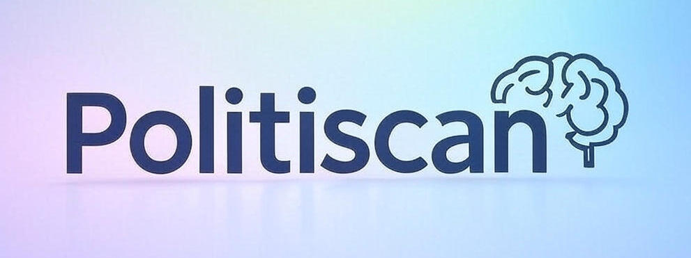
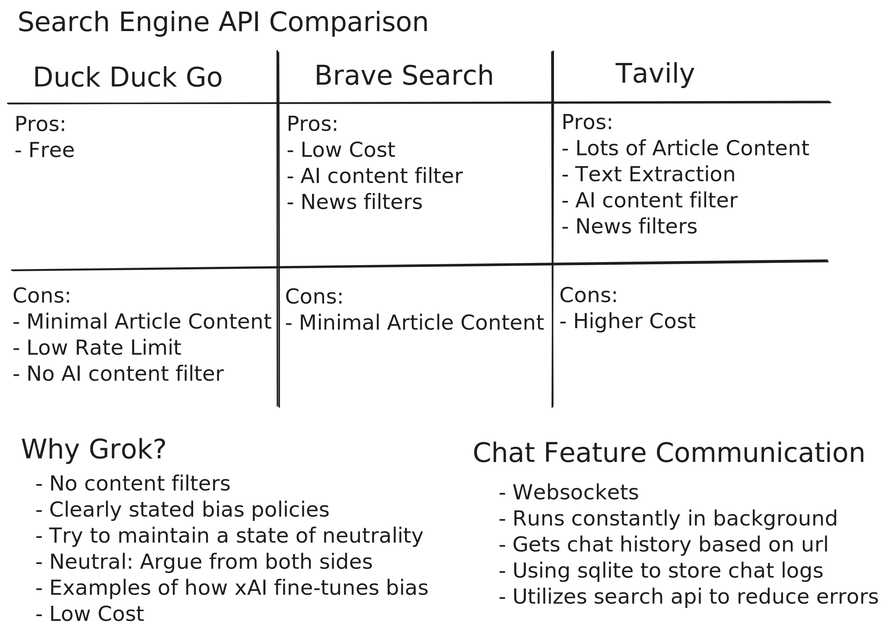

### Technology Decisions

### Possible Features / TODOs
- [ ] Figure out wrong url issue (extension grabs article from not current tab, possibly switch cache to use url instead of tabid)
- [x] Add feature to analze text selected in context menu (Ryan)
- [ ] Fix context menu selection so it doesnt mess up caching data
- [ ] Improve Text grabbing functionality
- [x] Fix bug where bias and factuality descriptions don't display
- [ ] Fix bug where bias and factuality decsriptions arent collapsible
- [x] Fix inital article click where it says "No article text found on this page" (Shaun)
- [ ] Select the context menu for text grabbing
- [ ] Better loading menu / fix flow errors
- [ ] Cleaner UI
- [x] YouTube/video caption downloader? (Nathan + Ryan)
- [ ] Chat Feature to ask questions about an article (Ryan)
- [x] Reduce context window size from tool call by cutting unnecessary info (Ryan)
- [x] Use Tavily search for better research (Ryan)
- [x] Speed up request by reducing the number of tool calls (Ryan)
- [ ] Switch to structured response format to prevent JSON format errors (Ryan)
- [ ] Add Show_Bias to analysis cache
- [x] Preload common articles for better UX (Ryan)
