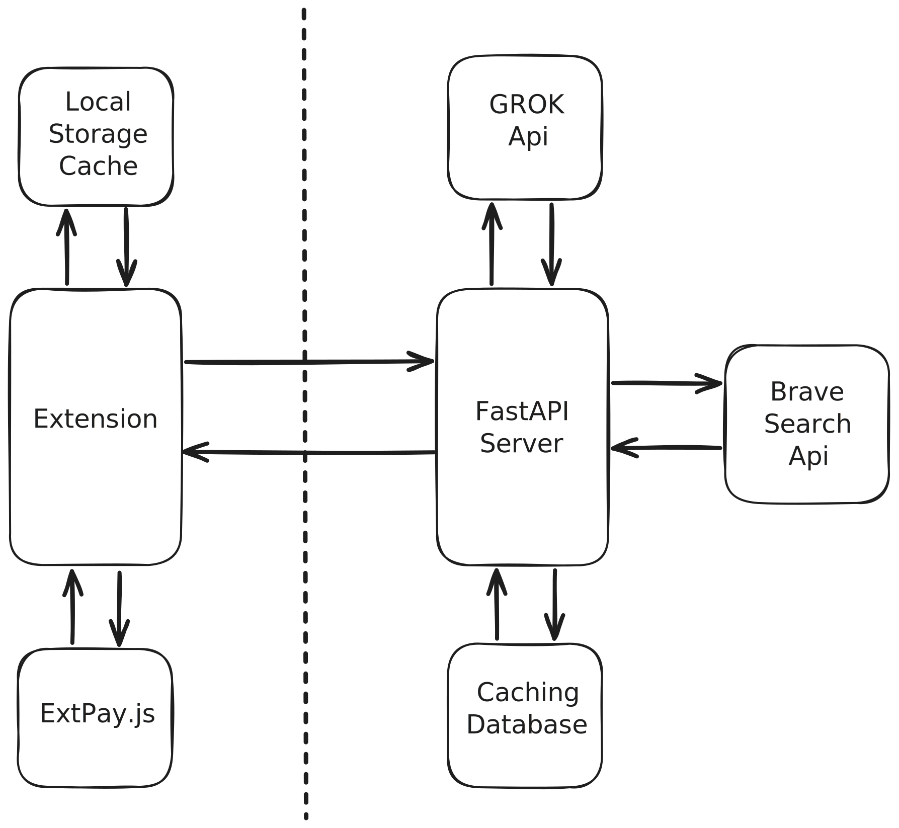

# Politiscan

### Project Structure

### API Choice
For this extension we use GROK completion with custom Brave Search API tooling

Speed Comparison of Models (based on analysis of this article https://www.npr.org/2025/04/22/nx-s1-5372588/trump-tariffs-imf-trade-world-economy):
| Model    | Speed |
| -------- | ------- |
| GROK-3   | 1m 17.9s |
| GROK-3-Fast | 25.57s |
| GROK-3-Mini    | 45.13s |
| GROK-3-Mini-Fast (chosen model)    | 28.46s |https://file+.vscode-resource.vscode-cdn.net/Users/ryanleroy/PikeLabsCompetition/docs/structure.excalidraw.svg

### Possible Features / TODOs
- [ ] Improve Text grabbing functionality
- [ ] Fix bug where bias and factuality descriptions don't display
- [ ] Fix inital article click where it says "No article text found on this page"
- [ ] Select the context menu for text grabbing
- [ ] Better loading menu / fix flow errors
- [ ] Cleaner UI
- [ ] Check mobile responsiveness, possibly different mobile interactions, like a new page
- [ ] YouTube/video caption downloader?
- [ ] Chat Feature to ask questions about an article
- [ ] Reduce context window size from tool call by cutting uneccesary info
- [ ] Use Brave news search for more sources and combine with url text api
- [ ] Switch to structured response format to prevent JSON format errors

### Possible Technologies
- Readability API for extracting article text in a much more sofiticated manner: https://github.com/mozilla/readability
